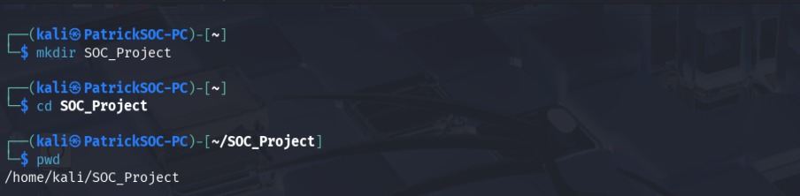
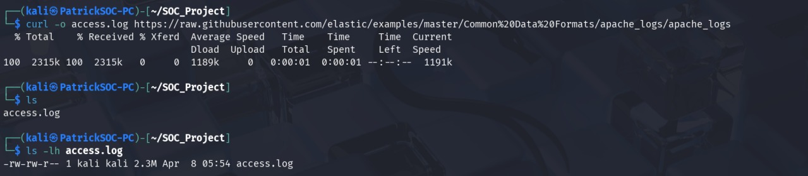
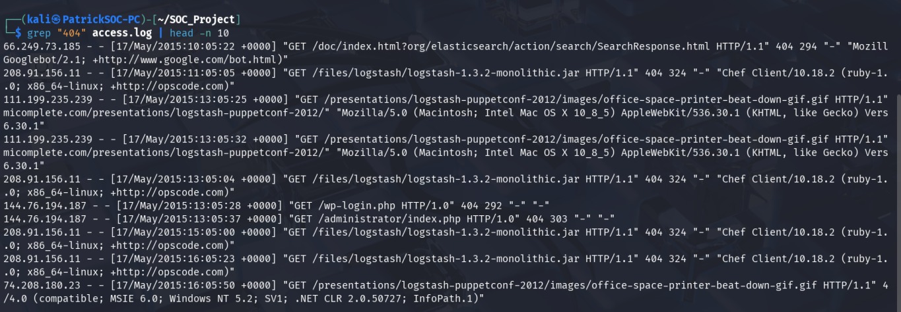
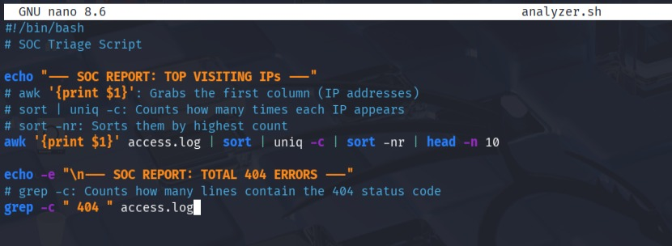
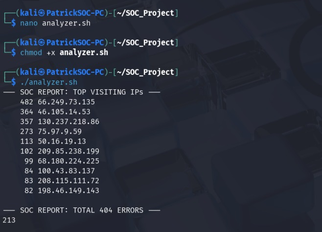

# 🛡️ Web Server Log Triage Tool (SOC Lab)
### **Author:** Kahindi Patrick
### **Role:** Cybersecurity Professional

## 🎯 Project Objective
This project demonstrates the transition from manual log analysis to automated security triage. By utilizing Bash scripting and Linux CLI tools, I’ve developed a utility that allows SOC analysts to quickly baseline web traffic and identify potential scanning or brute-force activities.

---

## 📸 Phase 1: Environment & Evidence Acquisition

### **Step 1: Lab Setup**
> **Technical Breakdown:** Initializing a clean workspace (`SOC_Project`). In digital forensics and incident response, maintaining a dedicated directory for evidence is a fundamental best practice to prevent cross-contamination of data.
> 

### **Step 2: Secure Data Acquisition**
> **Technical Breakdown:** Using `curl` to pull raw Apache access logs. This file represents the "Evidence" and contains the raw metadata of every request made to the web server, including source IP, timestamp, and HTTP status codes.
> 

---

## 🔍 Phase 2: Manual Threat Hunting

### **Step 3: Identification of 404 Error Spikes**
> **Technical Breakdown:** Before automating, I manually audited the logs using `grep` to isolate **404 (Not Found)** errors. A high volume of 404s can indicate "Directory Fuzzing," where an attacker uses automated tools to find hidden directories or vulnerable files.
> 

---

## 🛠️ Phase 3: Automation & Reporting

### **Step 4: The Triage Script Source Code**
> **Technical Breakdown:** I developed `analyzer.sh`, a Bash script that automates the triage process. It uses `awk` for field extraction and `sort | uniq -c` for frequency analysis. This script transforms thousands of lines of raw text into a summarized security report in milliseconds.
> 

### **Step 5: Final SOC Analysis Output**
> **Technical Breakdown:** The execution of the tool. 
> * **Traffic Baselining:** Identified the Top 10 IP addresses by volume.
> * **Anomaly Detection:** Quantified 213 total 404 errors, providing a clear metric for potential reconnaissance activity.
> * 

---

## 🧰 Skills & Tools Demonstrated
* **Security Automation:** Reducing "Time to Detect" (TTD) through scripting.
* **Log Analysis:** Deep understanding of Apache log architecture.
* **Linux CLI Mastery:** Advanced use of `grep`, `awk`, `sort`, and `chmod`.
